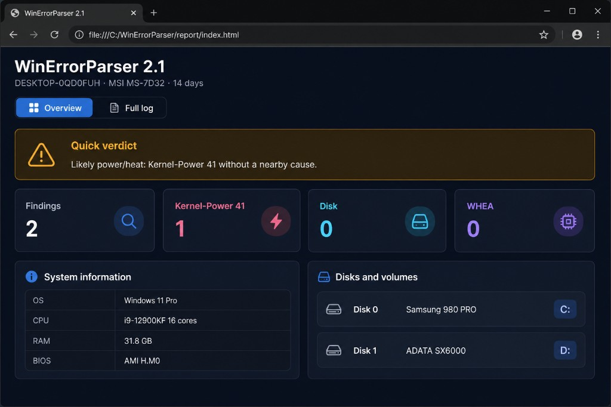

# WinErrorParser

<p align="center">
  <a href="#-русская-версия"></a>
  &nbsp;
  <a href="#-english-version"></a>
</p>

<p align="center">
  
  
  
  
  
</p>

<p align="center">
  <b><a href="#-русская-версия">Русский</a></b>
  ·
  <b><a href="#-english-version">English</a></b>
</p>

<p align="center">
  
</p>

---

# 🇷🇺 Русская версия

**WinErrorParser 2.1** — автономный офлайн-диагност Windows. Читает журналы и железо, отбрасывает шум, **расшифровывает BSOD**, смотрит окно **±5 минут** вокруг критичных сбоев и пишет отчёт **на русском или английском**: консоль, `.txt` и HTML-дашборд.

Интернет не нужен. Диагностика только читает. Очистка журналов меняет Event Log только после явного `ДА` / `YES`.

### Что нового в 2.1

- HTML-дашборд: вердикт, карточки, система и диски.
- Карточки **Фактов / Kernel-Power 41 / Диск / WHEA** кликабельны: если число > 0, открывается полный лог с фильтром.
- Краткая шапка в TXT, якоря в HTML.
- Вес событий: единичный сбой vs серия.
- Сравнение с прошлым прогоном в той же папке.
- Краши игр и браузеров скрыты и **не** тянут вердикт в железо.
- Контекст «сломалось после обновления Windows».
- Сон / Fast Startup, dirty bit / CHKDSK, USB–сеть–PCIe, дампы, дата BIOS.
- Меню: последний HTML, список отчётов, ZIP.

### Быстрый старт

1. Скачайте репозиторий. `Start-WinErrorParser.bat` и `WinErrorParser.ps1` должны лежать **в одной папке**.
2. ПКМ по `Start-WinErrorParser.bat` → **Запуск от имени администратора**.
3. Пункт **1** — диагностика.
4. Откройте свежий `WinErrorParser_Report_RU_YYYY-MM-DD_HHMMSS.html` или `.txt`. Краткая сводка копируется в буфер обмена.

> **Кодировка (важно):**
> - `WinErrorParser.ps1` — **UTF-8 с BOM**
> - `Start-WinErrorParser.bat` — **ASCII без BOM**
>
> Скачивайте файлы из репозитория целиком. Не копируйте код в Блокнот вручную.

---

## Содержание (RU)

1. [Меню](#меню)
2. [Что умеет скрипт](#что-умеет-скрипт)
3. [Состав проекта](#состав-проекта)
4. [Требования](#требования)
5. [Запуск](#запуск)
6. [HTML-дашборд](#html-дашборд)
7. [Очистка журналов](#очистка-журналов)
8. [Как устроен отчёт](#как-устроен-отчёт)
9. [Разделы диагностики](#разделы-диагностики)
10. [Расшифровка BSOD](#расшифровка-bsod)
11. [Анализ ±5 минут](#анализ-5-минут)
12. [Рекомендации по фактам](#рекомендации-по-фактам)
13. [Что скрывается как шум](#что-скрывается-как-шум)
14. [ParserError](#ошибка-parsererror--кракозябры)
15. [SHA256](#проверка-файлов-sha256)
16. [Ограничения и FAQ](#ограничения-и-faq)
17. [English](#-english-version)

---

## Меню

```text
1. Диагностика ПК (журнал + железо)
2. Очистка журналов событий
3. Период анализа (3 / 7 / 14 / 30 / 90)
4. Режим отчёта: неисправности / полный
5. Язык отчёта: ru / en
6. Открыть последний HTML
7. Последние отчёты
8. Упаковать последний отчёт в ZIP
0. Выход
```

После диагностики скрипт возвращается в меню.

---

## Что умеет скрипт

| Возможность | Зачем |
|-------------|--------|
| Меню + bat от администратора | Период, язык, архив, очистка журналов |
| Отчёт RU/EN: консоль, TXT, HTML | Понятные пояснения, файлы с датой в имени |
| HTML-дашборд | Вердикт, карточки, система, диски; клик по карточке открывает лог |
| Вес событий | Единичный vs серия, первое и последнее время |
| Сравнение с прошлым прогоном | Новое / стало больше / исчезло |
| Расшифровка BSOD | STOP-код, модуль/процесс, вероятная область |
| Фильтр шума | Update / DCOM / DNS скрыты; игры не влияют на вердикт |
| Корреляция ±5 мин | System + Application + Setup вокруг критичных событий |
| Диски / SMART / RAM | Имена томов, здоровье Windows, модули памяти |
| WHEA, Kernel-Power 41, 6008 | Железо, внезапные перезагрузки |
| Сон, Fast Startup, дампы | 41 после сна, включены ли минидампы |
| Dirty bit / USB / PCIe | Том закрыли нечисто, отвал шины |
| Очистка Event Log | Сначала `.evtx`, «все журналы» спрятаны |

Цвета в консоли: **зелёный** — чисто, **жёлтый** — внимание, **красный** — критично.

---

## Состав проекта

| Файл | Роль |
|------|------|
| `Start-WinErrorParser.bat` | Запуск, UAC, проверка BOM у `.ps1` (ASCII **без BOM**) |
| `WinErrorParser.ps1` | Диагностика и «меню» (UTF-8 **с BOM**), v2.1 |
| `LICENSE` | MIT |
| `docs/preview.png` | Превью HTML для GitHub |
| `examples/sample_report.txt` | Синтетический фрагмент TXT |
| `README.md` | Это руководство |

В git **не входят**: живые `WinErrorParser_Report_*`, `WinErrorParser_LastState.json`, ZIP и `logs_backup_*`.

---

## Требования

- Windows 10 / 11, Windows PowerShell **5.1**
- Права **администратора** для полной диагностики и очистки
- Интернет не нужен

Диагностика не меняет службы, реестр и драйверы.

---

## Запуск

**Через bat (рекомендуется):** оба файла в одной папке → bat от имени администратора.

```powershell
powershell.exe -NoProfile -ExecutionPolicy Bypass -File ".\WinErrorParser.ps1"
powershell.exe -NoProfile -ExecutionPolicy Bypass -File ".\WinErrorParser.ps1" -NonInteractive -DaysBack 30 -Language en -Action Diagnose
powershell.exe -NoProfile -ExecutionPolicy Bypass -File ".\WinErrorParser.ps1" -FullReport
```

Параметры: `-DaysBack`, `-Language ru|en`, `-FullReport`, `-NonInteractive`, `-Action Menu|Diagnose`, `-ReportPath`, `-NoHtml`.

---

## HTML-дашборд

Офлайн, без CDN. Вкладки **Обзор** и **Полный лог**.

- Карточки с числом > 0 можно нажать — откроется лог, отфильтрованный по теме.
- Карточка с **0** не кликается.
- В Обзоре: вердикт, система, диски с метками томов (`C:`, `D:`), индекс проблемности, лента.

TXT начинается с краткой шапки (вердикт, вес, сравнение). HTML пишется в UTF-8 **без BOM**, чтобы браузер не ругался на кодировку.

---

## Очистка журналов

Пункт **2**, нужны права администратора.

| Режим | Что чистится |
|-------|----------------|
| 1 | System, Application, Setup |
| 2 | То же + Security |
| 3 | Все включённые журналы с записями |

Подтверждение: **`ДА`** или **`YES`**. Полная очистка дополнительно требует **`ОЧИСТИТЬ ВСЁ`** / **`CLEAR ALL`**. Перед этим журналы сохраняются в `logs_backup_*`.

Сначала сохраните отчёт диагностики, потом чистите журналы.

---

## Как устроен отчёт

```text
КРАТКАЯ ШАПКА            ← вердикт, вес, сравнение, «после обновления»
Самопроверка             ← дампы, Fast Startup, reboot
Система / диски / RAM / температуры / батарея
Сон / WHEA / Kernel-Power 41 / 6008 / BSOD
Диск, dirty bit, GPU, USB/PCIe
Краши только системных процессов
Драйверы / обновления Windows
Частота и вес / сравнение с прошлым
АНАЛИЗ И РЕКОМЕНДАЦИИ
СВОДКА
```

Файлы: `WinErrorParser_Report_RU_гггг-ММ-дд_ЧЧммсс.txt` + одноимённый `.html`. Третьего дубля без даты нет.

---

## Разделы диагностики

Период по умолчанию: **14 дней** (меню **3** или `-DaysBack`).

1. Самопроверка — админ, дампы, Fast Startup, ожидание reboot  
2. Система — ОС, CPU, RAM, BIOS с датой, uptime  
3. Диски — здоровье Windows, SMART насколько отдаёт ОС, тома  
4. RAM, температуры ACPI, частота CPU, батарея  
5. Сон / 41 после resume  
6. WHEA, Kernel-Power 41, EventLog 6008, BSOD  
7. disk / NTFS / dirty bit / CHKDSK  
8. GPU и отвалы USB / сети / PCIe  
9. Краши системных процессов; игры скрыты  
10. Свежие драйверы и дата обновления Windows  
11. Частота и сравнение с прошлым отчётом  
12. Рекомендации только по найденным фактам  

---

## Расшифровка BSOD

Скрипт показывает код (`0x000000D1`), имя (`DRIVER_IRQL_NOT_LESS_OR_EQUAL`), вероятную область и модуль/процесс из события, Kernel-Power 41 или `Report.wer`.

База покрывает частые STOP (`0xA`, `0x1A`, `0x3B`, `0x50`, `0x7E`, `0x9F`, `0xD1`, `0xEF`, `0x116`, `0x124`, `0x133` и др.). Неизвестный код выводится без выдуманной причины.

---

## Анализ ±5 минут

До события / якорь / после / краткий вывод (диск, WHEA, BSOD, GPU или «причины рядом нет»). Шум в этом окне тоже скрыт.

---

## Рекомендации по фактам

- 41 + диск → бэкап и SSD/NVMe  
- серия ошибок диска сильнее единичного случая  
- BSOD → минидампы и STOP  
- WHEA / RAM → `mdsched`, XMP выкл  
- 41 после сна → выключить Fast Startup и проверить  
- dirty bit → бэкап и проверка тома  
- дампы выключены → включить минидампы  

Общих советов «почините Windows Update» нет.

---

## Что скрывается как шум

- Windows Update Client (кроме блока «последнее обновление»)  
- DCOM, DNS, DHCP, служба времени  
- SCM как отдельный топ  
- TPM / SPP / PerfNet и похожий фон  
- краши Steam, Chrome, Discord, игр  

Полный режим (меню **4**) показывает служебный шум, но **не** считает игры железом.

---

## Ошибка ParserError / кракозябры

`Unexpected token` / `hash literal was incomplete` / кириллица как `P?P?` → сохраните `WinErrorParser.ps1` как **UTF-8 with BOM**. Bat — **без BOM**.

---

## Проверка файлов (SHA256)

```powershell
Get-FileHash .\WinErrorParser.ps1, .\Start-WinErrorParser.bat -Algorithm SHA256
```

| Файл | SHA256 |
|------|--------|
| `WinErrorParser.ps1` | `31E800A170275B5CE68686E7C8DEB8F4F6C19AE47D1C7039883BBE2AF9653069` |
| `Start-WinErrorParser.bat` | `3F05F9EEF56ACDD039016C0980D6B42D3890F16A770374927F1BF4C460C70EEA` |

Хеши для релиза **2.1.0**.

---

## Ограничения и FAQ

- Не заменяет Memtest86 и утилиту производителя SSD.  
- После очистки журналов отчёт может быть «зелёным».  
- Без администратора диагностика неполная.  
- Полный NVMe SMART Windows не отдаёт.

**Период?** Меню **3** или `-DaysBack`.  
**Отчёт затирается?** Нет — каждый запуск с новой датой в имени.  
**Очистка удаляет TXT/HTML?** Нет, только журналы Windows.  
**Зачем `WinErrorParser_LastState.json`?** Память прошлого прогона для сравнения. В git не входит.  
**Лицензия:** [MIT](LICENSE).

---

## Шпаргалка (RU)

```text
Запуск:   Start-WinErrorParser.bat  (администратор)
Меню:     1 диагностика | 2 очистка | 3 период | 4 полный отчёт | 5 язык
          6 последний HTML | 7 список | 8 ZIP
Скрипт:   WinErrorParser.ps1        UTF-8 с BOM, v2.1
Отчёт:    WinErrorParser_Report_RU_дата.txt + .html
Период:   14 дней, корреляция ±5 мин
```

<p align="right"><a href="#winerrorparser">⬆ К переключателю языка</a></p>

---

# 🇬🇧 English version

**WinErrorParser 2.1** is an offline Windows PC diagnostics tool. It reads Event Logs and hardware inventory, filters noise, **decodes BSODs**, inspects a **±5 minute** window around critical faults, and writes a **Russian or English** report to the console, a timestamped `.txt`, and an HTML dashboard.

No Internet. Diagnostics are read-only. Log clearing changes Event Log only after you type `YES` / `ДА`.

### What’s new in 2.1

- HTML dashboard: verdict, stat cards, system, disks.
- Cards **Findings / Kernel-Power 41 / Disk / WHEA** are clickable when the count is > 0 — they open the full log filtered to that topic.
- Executive summary in the TXT, jump links in HTML.
- Event weight: single vs repeating series.
- Diff against the previous run in the same folder.
- Game/browser crashes are hidden and do **not** drive the hardware verdict.
- “Broke after a Windows update” context.
- Sleep / Fast Startup, dirty bit / CHKDSK, USB-NIC-PCIe, dump settings, BIOS date.
- Menu: last HTML, recent reports, ZIP.

### Quick start

1. Clone or download the repo. Keep `Start-WinErrorParser.bat` and `WinErrorParser.ps1` in the **same** folder.
2. Right-click the bat → **Run as administrator**.
3. Choose **1** — diagnostics.
4. Open the new `WinErrorParser_Report_*.html` or `.txt`.

> **Encoding:** `.ps1` = **UTF-8 with BOM**. `.bat` = **ASCII, no BOM**. Download repo files as-is.

---

## Table of contents (EN)

1. [Menu](#menu)
2. [Features](#features)
3. [Project files](#project-files)
4. [Requirements](#requirements)
5. [How to run](#how-to-run)
6. [HTML dashboard](#html-dashboard)
7. [Clearing Event Logs](#clearing-event-logs)
8. [Report layout](#report-layout)
9. [±5 minute analysis](#5-minute-analysis)
10. [Noise filtering](#noise-filtering)
11. [ParserError](#parsererror)
12. [SHA256](#file-hashes-sha256)
13. [Limits & FAQ](#limits--faq)
14. [Russian](#-русская-версия)

---

## Menu

```text
1. PC diagnostics (logs + hardware)
2. Clear Event Logs
3. Analysis period
4. Report mode: faults / full
5. Language: ru / en
6. Open last HTML report
7. Recent reports
8. Pack last report into a ZIP
0. Exit
```

---

## Features

| Feature | Purpose |
|---------|---------|
| Admin bat + menu | Period, language, archive, log clear |
| RU/EN console + TXT + HTML | Timestamped pair + clipboard summary |
| HTML dashboard | Verdict, cards, system, disks; click a card to filter the log |
| Event weight | Single vs series |
| Diff vs previous run | New / increased / gone |
| BSOD decode | STOP code, module/process, likely area |
| Noise filter | Update / DCOM / DNS hidden; games ignored for the verdict |
| ±5 min correlation | Around Kernel-Power / BSOD / WHEA / disk |
| Storage / RAM / WHEA / 41 / 6008 | Real hardware faults |
| Sleep, dumps, dirty bit, bus dropouts | Extra context without leaving the box |

---

## Project files

| File | Role |
|------|------|
| `Start-WinErrorParser.bat` | Launcher (ASCII, **no BOM**) |
| `WinErrorParser.ps1` | Tool (UTF-8 **with BOM**), v2.1 |
| `LICENSE` | MIT |
| `docs/preview.png` | GitHub preview |
| `examples/sample_report.txt` | Synthetic TXT snippet |
| `README.md` | This guide |

Live reports, `WinErrorParser_LastState.json`, ZIP files, and `logs_backup_*` are gitignored.

---

## Requirements

Windows 10 / 11, Windows PowerShell 5.1, **Administrator** for a full run. No Internet.

---

## How to run

```powershell
powershell.exe -NoProfile -ExecutionPolicy Bypass -File ".\WinErrorParser.ps1"
powershell.exe -NoProfile -ExecutionPolicy Bypass -File ".\WinErrorParser.ps1" -NonInteractive -DaysBack 30 -Language en -Action Diagnose
```

Parameters: `-DaysBack`, `-Language ru|en`, `-FullReport`, `-NonInteractive`, `-Action Menu|Diagnose`, `-ReportPath`, `-NoHtml`.

---

## HTML dashboard

Offline, no CDN. **Overview** and **Full log** tabs. A card with a count **> 0** opens the log filtered to that topic. A **0** card does nothing. HTML is UTF-8 **without BOM** so browsers do not show an encoding error.

---

## Clearing Event Logs

Menu **2**. Type **`YES`** or **`ДА`**. Wipe-all also needs **`CLEAR ALL`** / **`ОЧИСТИТЬ ВСЁ`**. Logs are exported to `logs_backup_*` first. Save a diagnostics report before clearing.

---

## Report layout

Executive summary → self-check → system / disks / RAM → sleep → WHEA / Kernel-Power 41 / BSOD → storage / GPU / bus → system-process crashes → drivers / Windows update → frequency / previous-run diff → fact-based analysis → summary.

Files: `WinErrorParser_Report_RU_yyyy-MM-dd_HHmmss.txt` + matching `.html`. Default window: **14 days**.

---

## ±5 minute analysis

Before / anchor / after plus a short window conclusion. Noise is filtered here too.

---

## Noise filtering

Hidden from the verdict: Windows Update Client, DCOM, DNS/DHCP, time service, SCM as a top source, TPM/SPP/PerfNet-like noise, and **game/browser crashes**. Full-report mode still does not treat Steam/Chrome as hardware.

---

## ParserError

`Unexpected token` / broken Cyrillic → save `WinErrorParser.ps1` as **UTF-8 with BOM**. Keep the `.bat` **without** BOM.

---

## File hashes (SHA256)

```powershell
Get-FileHash .\WinErrorParser.ps1, .\Start-WinErrorParser.bat -Algorithm SHA256
```

| File | SHA256 |
|------|--------|
| `WinErrorParser.ps1` | `31E800A170275B5CE68686E7C8DEB8F4F6C19AE47D1C7039883BBE2AF9653069` |
| `Start-WinErrorParser.bat` | `3F05F9EEF56ACDD039016C0980D6B42D3890F16A770374927F1BF4C460C70EEA` |

Release **2.1.0**.

---

## Limits & FAQ

Not a replacement for Memtest86 or a vendor SSD tool. Cleared logs can look “all green”. Non-admin runs are incomplete. Windows does not expose full NVMe SMART.

**License:** [MIT](LICENSE).

---

## Cheat sheet (EN)

```text
Launch:   Start-WinErrorParser.bat  (Administrator)
Menu:     1 diagnose | 2 clear | 3 period | 4 full | 5 language
          6 last HTML | 7 recent | 8 ZIP
Script:   WinErrorParser.ps1        UTF-8 with BOM, v2.1
Report:   WinErrorParser_Report_*_date.txt + .html
```

<p align="right"><a href="#winerrorparser">⬆ Back to language switcher</a></p>
